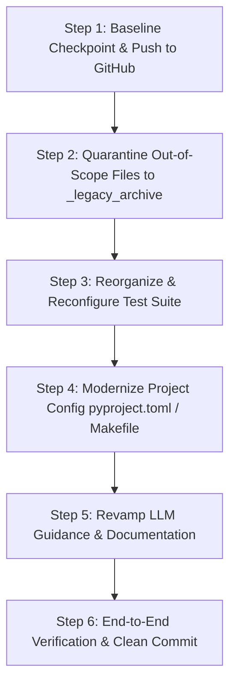

# DragMeToLabel: Repository Cleanup & Modular Refactoring Plan (v2)

Following the approval of the **DragMeToLabel** Proof of Concept (POC), we are cleaning and restructuring the repository. This plan incorporates all required steps:
1. **Safety Backup Snapshot**: A dedicated baseline commit and push to GitHub (`origin Dev`) before moving out-of-scope files.
2. **Fork Attribution in README**: Explicitly acknowledging the upstream `labelme` project (Kentaro Wada / MIT LabelMe) with links, while documenting DragMeToLabel.
3. **Git Branching Strategy in LLM Guidance**: Adopting the standard SOP branching, conventional commits, and PR workflow into `AGENTS.md` and `CLAUDE.md`.
4. **Alpha Versioning (0.1.0)**: Initializing all configs, changelogs, and metadata at version `0.1.0` (Alpha).

---

## Phased Implementation Plan



---

### Step 1: Baseline Checkpoint & Remote Backup Push

**Goal**: Guarantee an immutable snapshot on GitHub of the current state (POC files + legacy code) before touching repository structure.

1. Stage all existing POC files (`backend/`, `frontend/`, `tools/run_server.fish`, `AGENTS.md`, `CHANGELOG.md`).
2. Create a conventional commit:
   ```bash
   git commit -m "feat(poc): baseline snapshot of DragMeToLabel POC on top of labelme"
   ```
3. Push the `Dev` branch to `origin Dev` (`https://github.com/broli/DragmeTolabel.git`).

---

### Step 2: Quarantine Out-of-Scope Files & Legacy Code

**Goal**: Isolate all legacy Qt desktop code, legacy examples, and out-of-scope documentation into `_legacy_archive/` so that active workspace searches, linters, and LLM tools only see DragMeToLabel.

1. Create `_legacy_archive/` at repository root.
2. Move legacy directories and files into `_legacy_archive/`:
   - `labelme/` -> `_legacy_archive/labelme/` (legacy PyQt desktop application)
   - `tests/` (root legacy Qt test suite: `unit/`, `e2e/`, `data/`, `conftest.py`) -> `_legacy_archive/tests/`
   - `examples/` -> `_legacy_archive/examples/` (old desktop tutorials and dataset converters)
   - `tools/release_notes.py`, `tools/update_translate.py` -> `_legacy_archive/tools/` (keeping `tools/run_server.fish`)
   - `docs/adr/` (ADRs 0001-0006 regarding Qt desktop app) -> `_legacy_archive/docs/adr/`
   - `docs/agents/issue-tracker.md`, `docs/agents/triage-labels.md` -> `_legacy_archive/docs/agents/`
   - `.out-of-scope/` -> `_legacy_archive/.out-of-scope/`
   - `CITATION.cff`, `CLA.md` -> `_legacy_archive/`
3. Add `_legacy_archive/` to `.gitignore`.

---

### Step 3: Clean & Reorganize Test Suite

**Goal**: Establish a streamlined, zero-warning test suite for DragMeToLabel.

1. Establish `tests/` at repository root with `tests/test_backend.py` (migrated from `backend/tests/test_backend.py`).
2. Configure `pytest` settings in `pyproject.toml`:
   - Remove legacy PyQt markers (`qt_api = "pyside6"`).
   - Set `pythonpath = ["."]` so imports (`backend.app...`) resolve automatically.
3. Validate that `pytest` discovers and passes all tests (homography, presets, materials, renderer, and labelme export bridge) with 0 warnings.

---

### Step 4: Modernize Project Configuration & Build System

**Goal**: Align `pyproject.toml`, `Makefile`, and environment configs with DragMeToLabel's real stack at version `0.1.0`.

1. **`pyproject.toml`**:
   - Project name: `dragmetolabel`
   - Version: `0.1.0` (Alpha)
   - Description: "Computer Vision & Polygon Surface Replacement Web Application for Sales Reps"
   - Prune obsolete heavy dependencies (`pyside6`, `osam`, `onnxruntime`, `imgviz`, `natsort`, `ruamel-yaml`, `tifffile`, `pytest-qt`).
   - Declare active runtime dependencies: `fastapi`, `uvicorn`, `opencv-python-headless`, `numpy`, `pillow`, `scipy`, `pydantic`.
   - Declare dev dependencies: `pytest`, `ruff`, `httpx`.
   - Update `[project.scripts]` to entrypoint `dragmetolabel = "backend.app.main:app"`.
2. **`backend/app/main.py`**:
   - Set `version="0.1.0"` on FastAPI instance.
3. **`Makefile`**:
   - Clean targets: `make dev` (start uvicorn server), `make test` (run pytest), `make lint` / `make format` (ruff).
4. **`.github/workflows/`**:
   - Update CI workflow `test.yml` for clean Python 3.12/3.13/3.14 testing without Xvfb or Qt packages.

---

### Step 5: Revamp LLM Directives & Project Documentation

**Goal**: Provide clear, accurate, and concise guidelines for LLMs and developers working on DragMeToLabel.

1. **`AGENTS.md` & `CLAUDE.md`**:
   - **Git Branching Strategy**:
     - Hierarchy: `main` (production), `Dev` (integration/staging), and `<author>/<type>-<short-description>` (feature/bugfix/refactor/hotfix).
     - Standard: Conventional Commits (`feat(...)`, `fix(...)`, `refactor(...)`, `docs(...)`, `chore(...)`).
     - Rules: No direct pushes to `main`, no force pushes, PRs target `Dev`.
   - **Architecture & Layout**:
     - `backend/app/cv`: OpenCV homography, materials, lighting, and rendering engine.
     - `backend/app/core`: Presets, geometry schemas, and Labelme JSON interoperability bridge.
     - `backend/app/api`: FastAPI route handlers (`/api/v1/presets`, `/materials`, `/preview`, `/export-labelme`).
     - `frontend/`: Vanilla HTML5/CSS3/ES6 interactive visualizer (canvas, loupe, comparison slider).
     - `tests/`: Pytest suite.
   - **Dev Workflows**: Test commands (`pytest`), formatters (`ruff`), and server launch commands.
2. **`README.md`**:
   - **Upstream Attribution**: Clearly state that DragMeToLabel originated as an adaptation/fork inspired by [labelme](https://github.com/wkentaro/labelme) by Kentaro Wada / MIT LabelMe, with direct links for users seeking the general-purpose desktop annotation tool.
   - **DragMeToLabel Overview**: Highlight 2.5D surface replacement, OpenCV homography engine, mobile touch loupe, preset catalog, lighting preservation, and quickstart commands.
3. **`CONTEXT.md`**:
   - Rewrite glossary with DragMeToLabel domain concepts:
     - **Presets**: 2.5D surface templates (`floor`, `ceiling`, `corner_bath`, `alcove_bath`, `cali_bath`).
     - **Planes**: Planar quads with ordered vertex indices and perspective constraints.
     - **Control Points**: Draggable coordinates on the canvas with touch loupe and whole-polygon translation.
     - **Homography**: OpenCV perspective transformation (`cv2.getPerspectiveTransform` + `cv2.warpPerspective`).
     - **Material Catalog**: Realistic surface textures and procedural generation.
     - **Lighting Engine**: Luminance and shadow preservation blending.
     - **Labelme Bridge**: Headless export to standard Labelme 5.x JSON format.
4. **`CHANGELOG.md`**:
   - Initialize version `[0.1.0] - 2026-08-20` (Alpha) for DragMeToLabel following Keep a Changelog.
5. **`docs/`**:
   - Create `docs/architecture.md` (data flow from canvas to OpenCV renderer and Base64 preview response).

---

### Step 6: Codebase Audit & Sanity Verification

**Goal**: Validate full system functionality end-to-end.

1. Verify backend imports and server startup via `uvicorn backend.app.main:app`.
2. Verify all API endpoints:
   - `GET /api/v1/presets`
   - `GET /api/v1/materials`
   - `POST /api/v1/preview`
   - `POST /api/v1/export-labelme`
   - `GET /` (serves `frontend/index.html`)
3. Execute all automated tests (`pytest -v`) with 0 errors and 0 warnings.
4. Run linters (`ruff check`).
5. Create a clean commit of the newly organized repository state on `Dev`.

---

## Verification Plan

### Automated Tests
```bash
# Run test suite
.venv/bin/pytest -v

# Run linter checks
.venv/bin/ruff check backend/ tests/
```

### Manual Verification
1. Launch server:
   ```bash
   ./tools/run_server.fish
   ```
2. Verify browser rendering:
   - Load `http://localhost:8000/`
   - Verify sample photo loading and preset selection (Floor, Corner Bath, Alcove Bath).
   - Verify vertex dragging, touch loupe magnifier, and instant OpenCV preview rendering.
   - Verify Labelme JSON export.
